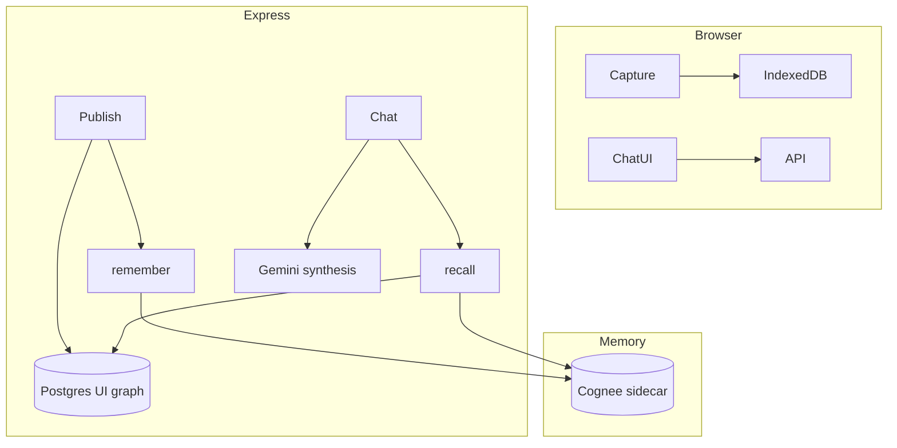

# Consilium × Cognee: Giving Legal AI a Memory That Survives the Session

**Draft for WeMakeDevs Cognee Hackathon — Best Blogs side track**

---

## Hook: Your AI woke up in Vegas

The [Cognee hackathon theme](https://www.wemakedevs.org/hackathons/cognee) asks a question every enterprise builder recognizes: *where's my context?* Law firms feel this acutely. When a senior litigator leaves, institutional memory walks out the door — scattered across email, matter folders, and the heads of people who never wrote it down.

We built **Consilium** as a privacy-first knowledge fabric: capture locally, redact before publish, query with citation-grounded answers and a graph overlay. But our MVP chat was still **stateless** — four turns of history, then amnesia.

Cognee gave us the missing layer: a hybrid graph-vector memory that compounds across sessions without breaking our privacy architecture.

---

## The problem we had

Consilium already had:

- **Personal brain** — IndexedDB, never leaves the browser unsanitized
- **Team graph** — Postgres + pgvector, Cytoscape visualization, citation panels
- **Custom RAG** — embed → vector search → 1-hop expand → Gemini synthesis

What we didn't have:

- Persistent memory across chat sessions
- A graph-native ingestion pipeline beyond single-node inserts
- A story that maps cleanly to Cognee's judging criteria

---

## The decision: hybrid, not replacement

We rejected replacing Postgres with Cognee wholesale. Our **query overlay** — the signature demo moment where cited nodes pulse on the team graph — depends on stable Postgres UUIDs.

Instead we chose **dual-write**:

```
Publish (redacted) → Postgres node + Cognee remember()
Chat (knowledge)   → Cognee recall() → map to Postgres → Gemini synthesis
Session end        → Cognee improve()
Retraction         → Cognee forget() + Postgres delete
```

Every Cognee ingest includes a marker:

```
CONSILIUM_NODE_ID:{postgres-uuid}
```

Recall parses that marker, loads full nodes from Postgres, and the overlay still works.

**Mistake we almost made:** embedding `@cognee/cognee-ts` natively on Windows. Official integrations use an HTTP sidecar; we followed that pattern with `cognee/cognee:main` in Docker Compose.

---

## What we built

### Phase 0 — Tooling

- Docker sidecar on port 8000 (`infra/docker-compose.yml`)
- Cursor MCP on port 8001 for dev agent memory (separate dataset)
- Agent rules, skills, smoke script, build journal in `docs/build-journey/`

### Phase 1–2 — remember on publish

After redaction and Postgres insert, `rememberInsight()` sends structured text to Cognee. Publish succeeds even if Cognee is down — we log and continue.

Seed script syncs the demo corpus via `syncInsightsToCognee()`.

### Phase 3 — recall + improve in chat

Knowledge-path chat tries Cognee recall first (`CHUNKS`, `scope: auto`), with pgvector fallback via `COGNEE_FALLBACK_TO_PGVECTOR=true`.

Session IDs live in `sessionStorage`. After each grounded answer, we store Q&A via `remember/entry`. **Save session** and **New session** call `improve()` to bridge session memory into the permanent graph — the cross-session demo beat.

### Phase 4 — forget on retraction

Deleting a team graph node triggers Cognee `forget()` when `metadata.cognee_data_id` exists — surgical deletion for a governed legal product.

---

## Architecture



---

## What we'd tell our past selves

1. **Start the sidecar early.** Empty recall before seed sync looks like a bug.
2. **Keep the fallback.** Demo day network failures happen.
3. **Document mistakes in the journal**, not just wins — judges (and future you) care about the journey.
4. **Don't conflate dev MCP memory with demo data.** Separate datasets: `consilium-dev` vs `acme-litigation`.

---

## Try it

```powershell
cd infra
copy cognee.env.example cognee.env
# Set LLM_API_KEY to your Gemini key
docker compose up -d
cd ..
.\scripts\cognee-smoke.ps1
```

Full journal: [`docs/build-journey/`](./README.md)

---

## Closing

Cognee didn't replace Consilium's privacy story — it **completed** it. Capture stays local. Publish stays governed. But memory now compounds: publish once, recall forever, improve across sessions, forget when policy demands it.

That's the difference between an AI that wakes up in Vegas and one that remembers where Doug is.
